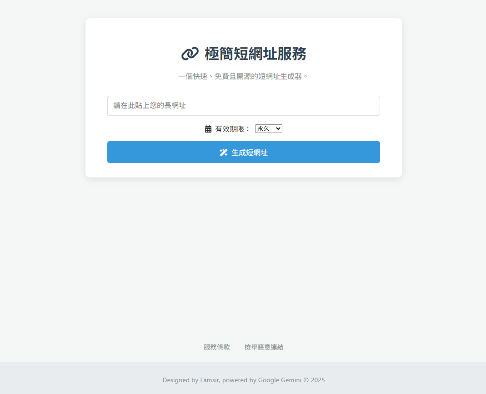
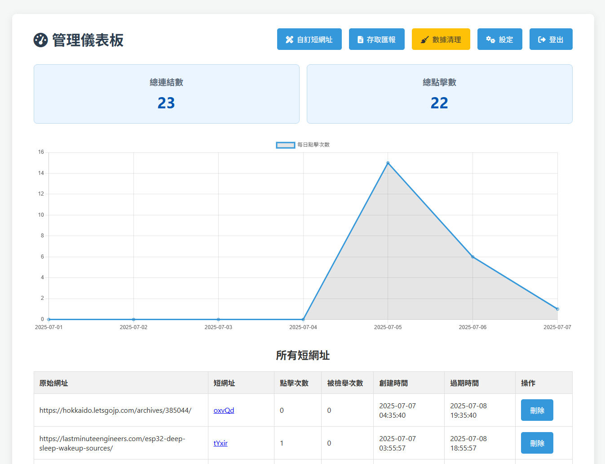
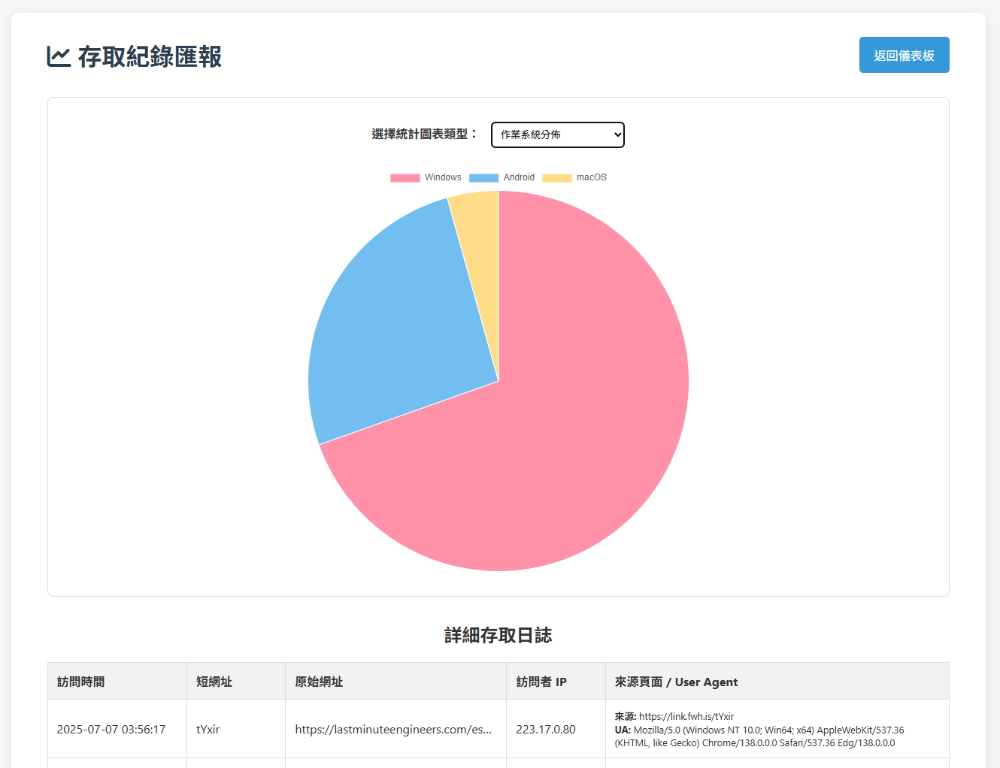

# 極簡短網址服務 (Simple URL Shortener)

一個功能完整、可自行託管的開源短網址服務平台。使用原生 PHP 和 MySQL 建立，輕量、高效且易於部署。





## ✨ 功能特色

* **智慧短網址生成**: 可自動生成唯一的隨機短網址，或由管理員在後台建立易於記憶的自訂短碼 (例如 `your.domain/my-event`)。
* **彈性有效期限**: 為每個連結設定有效期限（1天、7天、永久等），適用於臨時活動或長期推廣。
* **一鍵產生 QR Code**: 自動為每個短網址產生對應的 QR Code，方便在行動裝置上掃描與分享。
* **強大的管理儀表板**:
    * **數據總覽**: 以卡片和圖表形式查看總連結數、總點擊數及每日點擊趨勢。
    * **權限管理**: 輕鬆管理所有自動生成及自訂的短網址，並可隨時更改管理員密碼。
    * **訪客分析**: 提供詳細的存取紀錄匯報，並可透過動態圖表分析流量來源 (IP、瀏覽器、作業系統)。
* **全方位的安全性機制**:
    * **防濫用**: 內建 IP 頻率限制，有效防止機器人大量生成連結。
    * **惡意連結防護**: 可整合 Google Safe Browsing API，在生成時自動檢測並阻擋惡意網址。
    * **社群監督**: 提供公開的檢舉管道，讓社群共同維護平台安全。
* **自動化維護**: 提供手動及自動化的數據清理腳本，可定期清除過期紀錄，維持資料庫健康。

## 🛠️ 技術堆疊

* **後端**: 原生 PHP
* **資料庫**: MySQL / MariaDB
* **前端**: HTML5, CSS3, 原生 JavaScript
* **圖表**: [Chart.js](https://www.chartjs.org/)
* **QR Code**: [qrcode.js](https://github.com/davidshimjs/qrcodejs)

## 🚀 安裝與設定

1.  **下載專案**:
    ```bash
    git clone [https://github.com/your-username/your-repo-name.git](https://github.com/your-username/your-repo-name.git)
    ```
    (請將 `your-username/your-repo-name` 替換為實際的儲存庫路徑)

2.  **建立資料庫**:
    * 登入您的 MySQL/MariaDB 伺服器。
    * 建立一個新的資料庫 (例如 `shortener_db`)。
    * 將專案根目錄下的 `database_schema.sql` 檔案匯入到您剛剛建立的資料庫中。這將會建立所有必要的資料表及初始的管理員密碼。

3.  **設定連線**:
    * 將 `config.sample.php` 複製一份，並重新命名為 `config.php`。
    * 打開 `config.php`，並根據您的環境填寫所有必要的資訊 (`DB_HOST`, `DB_USER`, `DB_PASS`, `DB_NAME`, `BASE_URL` 等)。

4.  **上傳檔案**:
    * 將專案的所有檔案（除了 `.git` 資料夾和 `config.sample.php`）上傳至您的網站伺服器。
    * 確保您的 Apache 伺服器已啟用 `mod_rewrite` 模組。

5.  **首次登入與密碼重設**:
    * 訪問 `http://您的網域/admin`。
    * 使用預設密碼 `password` 登入。
    * **首次登入後，請務必立即前往「設定」頁面更改您的密碼，並從伺服器刪除 `reset_password.php` 檔案。**
    * **疑難排解**: 如果預設密碼無法登入，可能是因為您的 PHP 環境與預設的密碼雜湊值不相容。請訪問 `http://您的網域/reset_password.php`，依照頁面指示產生一個新的密碼雜湊值，並手動更新到資料庫的 `settings` 表中。完成後，請務必從伺服器刪除 `reset_password.php` 檔案。

## ⚙️ 自動化數據清理 (可選)

本專案提供一個可由 Google Apps Script 自動觸發的清理腳本，用於定期清除過期的短網址和日誌，以維持資料庫的健康。

1.  **建立 Google 試算表**: 前往 [Google Sheets](https://sheets.new) 建立一個新的試算表，用於接收每次自動清理的執行日誌。
2.  **開啟 Apps Script**: 在試算表中，點擊頂部選單的「擴充功能」 > 「Apps Script」。
3.  **貼上程式碼**: 找到並打開您專案中的 `apps_script_cleanup.js` 檔案 (此檔案需由您自行建立，可參考專案文件中的範例)，將其內容完整貼入 Apps Script 編輯器中。
4.  **修改腳本變數**: 在 Apps Script 程式碼的開頭，將 `CLEANUP_URL` (應指向您伺服器上的 `cron_cleanup.php`) 和 `SECRET_KEY` (應與您 `config.php` 中的設定相同) 修改為您自己的設定。
5.  **建立觸發器**:
    * 儲存腳本。
    * 從函式下拉選單中選擇 `createTrigger` 並點擊「▶️ 執行」。
    * Google 會要求您授權此腳本。請按照畫面指示，點擊「審查權限」，選擇您的 Google 帳號，然後在「不安全」的警告畫面上，點擊「進階」 > 「前往... (不安全)」，最後點擊「允許」。
    * 成功後，系統將會每小時自動執行一次清理任務。

## 🤝 貢獻

歡迎任何形式的貢獻！無論是回報問題、提出新功能建議，還是直接改進程式碼，都對這個專案有極大的幫助。

**建議流程：**

1.  **提出想法**: 如果您有任何想法或發現了 Bug，請先建立一個 [Issue](https://github.com/your-username/your-repo-name/issues) 來進行討論。
2.  **Fork 專案**: 將此儲存庫 Fork 到您自己的帳號下。
3.  **建立分支**: 為您的修改建立一個新的分支 (`git checkout -b feature/AmazingFeature`)。
4.  **提交您的修改**: 進行修改並提交 (`git commit -m 'Add some AmazingFeature'`)。
5.  **Push 到您的分支**: (`git push origin feature/AmazingFeature`)。
6.  **發送 Pull Request**: 回到本專案的頁面，發送一個 Pull Request，並詳細說明您的修改內容。

感謝您的貢獻！

## 📄 授權

本專案採用 [MIT License](https://www.google.com/search?q=LICENSE) 授權。
